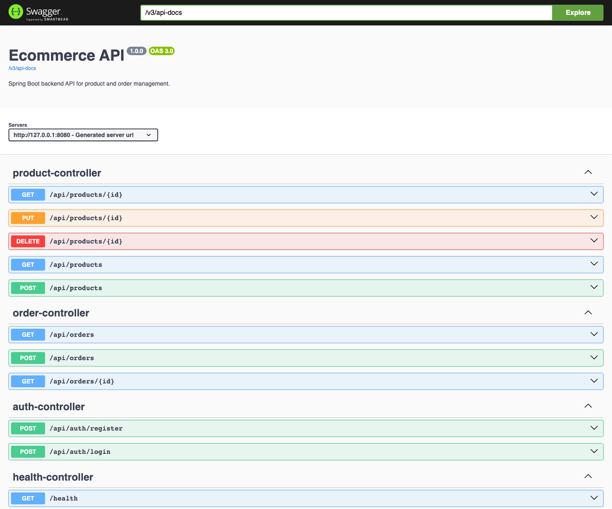

# Ecommerce API

## Overview

Spring Boot backend API for an ecommerce system. This project is built as a Java Backend portfolio project with layered architecture, request validation, database migration, integration tests, and OpenAPI documentation.

## Features

- Product CRUD API
- Order creation API
- Stock validation when creating orders
- Optimistic locking for product stock updates
- User registration and login
- JWT authentication
- Role-based authorization
- DTO-based request and response models
- Bean Validation for request body
- Global exception handling
- PostgreSQL schema management with Flyway
- OpenAPI / Swagger UI
- Docker image build
- GitHub Actions CI
- Unit and integration tests

## Tech Stack

- Java 21
- Spring Boot 3
- Spring Web
- Spring Data JPA / Hibernate
- Bean Validation
- PostgreSQL
- Flyway
- H2 for tests
- Docker
- Swagger UI / OpenAPI
- JUnit 5 / MockMvc
- Spring Security / JWT
- Testcontainers

## Architecture

```txt
Controller -> Service -> Repository -> Database
```

Main packages:

```txt
controller/   REST controllers
service/      Business logic
repository/   Spring Data JPA repositories
entity/       JPA entities
dto/          API request and response objects
exception/    Global error handling
config/       Application configuration
```

## Run Database

```bash
docker compose up -d
```

Database defaults:

```txt
DB_NAME=ecommerce
DB_USER=ecommerce
DB_PASSWORD=ecommerce
```

## Run Tests

```bash
mvn test
```

## Run Verification

```bash
mvn verify
```

`mvn verify` also includes the Testcontainers PostgreSQL integration test. If Docker is not running, that test is skipped.

## Run Application

```bash
mvn spring-boot:run
```

## Swagger UI

After starting the application, open:

```txt
http://localhost:8080/swagger-ui.html
```

OpenAPI JSON:

```txt
http://localhost:8080/v3/api-docs
```

## Screenshots

Swagger UI:



## Demo Flow

See [docs/demo-flow.md](docs/demo-flow.md) for a full demo flow:

1. Register admin
2. Create product
3. Register user
4. Create order
5. Check product stock

## Product API

| Method | Endpoint | Description |
| --- | --- | --- |
| GET | `/api/products` | Get all products |
| GET | `/api/products/{id}` | Get product by id |
| POST | `/api/products` | Create product, ADMIN only |
| PUT | `/api/products/{id}` | Update product, ADMIN only |
| DELETE | `/api/products/{id}` | Delete product, ADMIN only |

## Auth API

| Method | Endpoint | Description |
| --- | --- | --- |
| POST | `/api/auth/register` | Register user |
| POST | `/api/auth/login` | Login and receive JWT |

Register admin user:

```bash
curl -X POST http://localhost:8080/api/auth/register \
  -H "Content-Type: application/json" \
  -d '{
    "username": "admin",
    "password": "password123",
    "role": "ADMIN"
  }'
```

Login:

```bash
curl -X POST http://localhost:8080/api/auth/login \
  -H "Content-Type: application/json" \
  -d '{
    "username": "admin",
    "password": "password123"
  }'
```

Create product:

```bash
curl -X POST http://localhost:8080/api/products \
  -H "Content-Type: application/json" \
  -H "Authorization: Bearer <JWT_TOKEN>" \
  -d '{
    "name": "Keyboard",
    "description": "Mechanical keyboard",
    "price": 120.50,
    "stockQuantity": 10
  }'
```

Example response:

```json
{
  "id": 1,
  "name": "Keyboard",
  "description": "Mechanical keyboard",
  "price": 120.50,
  "stockQuantity": 10,
  "createdAt": "2026-05-17T09:00:00",
  "updatedAt": "2026-05-17T09:00:00"
}
```

## Order API

| Method | Endpoint | Description |
| --- | --- | --- |
| GET | `/api/orders` | Get all orders |
| GET | `/api/orders/{id}` | Get order by id |
| POST | `/api/orders` | Create order, USER or ADMIN only |

Create order:

```bash
curl -X POST http://localhost:8080/api/orders \
  -H "Content-Type: application/json" \
  -H "Authorization: Bearer <JWT_TOKEN>" \
  -d '{
    "items": [
      {
        "productId": 1,
        "quantity": 2
      }
    ]
  }'
```

Example response:

```json
{
  "id": 1,
  "status": "CREATED",
  "totalAmount": 241.00,
  "items": [
    {
      "productId": 1,
      "productName": "Keyboard",
      "quantity": 2,
      "unitPrice": 120.50,
      "lineTotal": 241.00
    }
  ],
  "createdAt": "2026-05-17T09:00:00",
  "updatedAt": "2026-05-17T09:00:00"
}
```

## Error Response

Validation error example:

```json
{
  "timestamp": "2026-05-17T09:00:00",
  "status": 400,
  "error": "Bad Request",
  "message": "Request validation failed",
  "path": "/api/products",
  "validationErrors": {
    "name": "Product name is required"
  }
}
```

## Implemented Tests

- Product service unit tests
- Product API integration tests with MockMvc
- Order API integration tests with MockMvc
- Auth API integration tests with MockMvc
- Spring context load test with H2 and Flyway
- PostgreSQL integration test with Testcontainers
